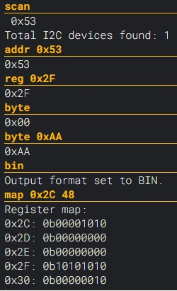

# I2C Command Line Interface (CLI)

## Overview
The I2C Command Line Interface (CLI) project is designed to facilitate direct interaction with I2C devices without the need for writing code. It serves as a convenient tool for testing and exploring I2C devices, enabling users to quickly check register values, test write capabilities, and understand device behaviors. This project is particularly useful for developers and electronics enthusiasts looking to experiment with or debug I2C devices, offering a straightforward way to send commands and receive responses through a simple serial connection.

## Getting Started
You only need to

1. Flash the MCU
2. Connect the I2C device
3. Connect to the MCU via the serial terminal

Here's an example session showing how you can communicate with an I2C device:

## Firmware
Compiled binary files can be downloaded from the Releases section. These files can be flashed to the ESP8266 using this [online flashing tool](https://esp.huhn.me/). 

After flashing, you can interact with the device using the [serial terminal](https://serial.huhn.me/).

Special thanks to [@SpacehuhnTech](https://github.com/SpacehuhnTech) for providing the flashing and terminal utilities.

## Commands
- `addr [i2c_address]`: Get or set the I2C address.
- `reg [register_address]`: Get or set the register address.
- `bit [position] [value]`: Get or set the bit at the specified position.
- `byte [value]`: Get or set the byte at the current register address.
- `bits [start pos] [end pos] [val]`: Get or set multiple bits from start to end positions.
- `map [start] [end]`: Show a map of registers from start to end.
- `scan`: Scan the I2C bus for devices.
- `hex`: Set the output format to HEX.
- `bin`: Set the output format to BIN.
- `help`: Show the list of available commands.

## Other devices
Since Wi-Fi or other special ESP8266 peripherals are not used here, this code can be used on other microcontrollers supported by ArduinoIDE
